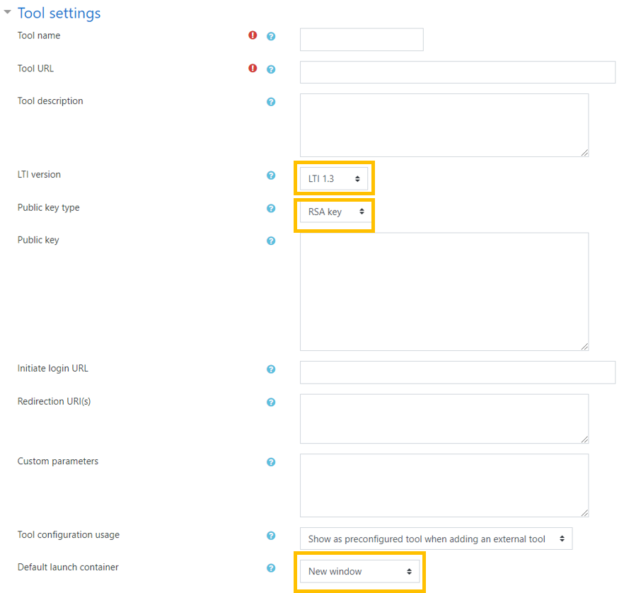
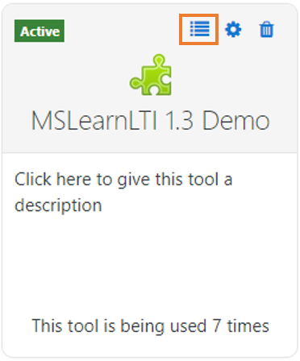
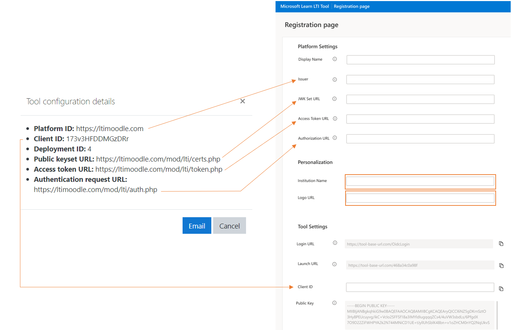

# Configure the tool

The Microsoft Learn LTI application adheres to LTI v.1.1 and v1.3. The following guide shows the steps to configure several popular LMS to work with the Microsoft Learn LTI application. If your LMS is not listed here, consult your LMS vendor on how to configure LTI application. Regardless of the LMS, the typical workflow is the same:

1. Obtain parameters from the deployed Microsoft Learn LTI application’s registration page
2. Configure an LTI tool on the LMS using the parameters from step 1.
3. Obtain parameters from the configured LTI tool.
4. Configure the Microsoft Learn LTI application using the parameters from step 3.

By now, you should already obtained the following parameters from the Microsoft Learn LTI application’s registration page.

- Login URL
- Launch URL
- Domain URL
- Public JWK Set URL

If you are not the one who deployed the application, you need to obtain the parameters from that person.

The configuration steps are slightly different depending on the LMS you are using. In general they will involve registering the Learn LTI application as an external tool in the LMS and registering the parameters back in the Learn LTI application's registration page. The following examples show how to configure Learn LTI application with three of the popular LMS.

- Moodle
- Canvas
- Blackboard

## Moodle LMS

The following steps show how to configure an LTI tool on a Moodle LMS.

### LTI 1.1
1. Open your LMS and sign in with the admin account.
2. Click **Site administration** from the left navigation pane.
3. Select **Plugins**.
4. Under **Activity modules**, click **Manage tools**.
5. Click **configure a tool manually**.
6. Enter the following information:
 * **Tool name**: give the tool a name of your choice.
 * **Tool URL**: https://[lti-domain-url]/api/launch-lti1 where [lti-domain-url] is the Domain URL field from Microsoft Learn LTI application’s registration page. 
 * **LTI version**: LTI 1.0/1.1
 * **Consumer key**: key
 * **Shared secret**: secret
 * **Default launch container**: New window
7. Under **Services**, **IMS LTI Names and Role Provisioning**: select **Use this service to retrieve members’ information as per privacy settings**.
8. Under **Privacy**, select the following options:
 * **Share launcher’s name with tool**: Always
 * **Share launcher’s email with tool**: Always
 * **Accept grades from the tool**: Always
9. Click **Save changes**. The tool should now appear and listed with the name you provided. 

### LTI 1.3
1. Open your LMS and sign in with the admin account.
2. Click **Site administration** from the left navigation pane.

3. Select **Plugins**.

4. Under **Activity modules**, click **Manage tools**.

5. Click **configure a tool manually**.

6. Enter the following information:
 * **Tool name**: give the tool a name of your choice
 * **Tool URL**: enter the "Launch URL" from Microsoft Learn LTI application’s registration page  Microsoft Learn LTI application’s registration page.
 * **LTI version**: LTI 1.3
 * **Public keyset**: enter "Public JWK Set URL" from the Microsoft Learn LTI application’s registration page.
 * **Initiate login URL**: enter "Login URL" from the Microsoft Learn LTI application’s registration page.
 * **Redirection URI(s)**: enter the "Launch URL" from Microsoft Learn LTI application’s registration page.
 * **Default launch container**: New window

7. Under **Services**, **IMS LTI Names and Role Provisioning**: select **Use this service to retrieve members’ information as per privacy settings**.

8. Under **Privacy**, select the following options:
 * **Share launcher’s name with tool**: Always
 * **Share launcher’s email with tool**: Always
 * **Accept grades from the tool**: Always

9. Click **Save changes**. The tool should now appear and listed with the name you provided. 
10.	Click the icon on the tool that represent **View configuration details**.

11. Take note of the following parameters:
 * Platform ID
 * Client ID
 * Public keyset URL
 * Access token URL
 * Authentication request URL
11.	Continue to configure the Microsoft Learn LTI application, by registering the parameters back in the Learn LTI application's registration page.

The following steps show how to register the parameters back in the Learn LTI application's registration page. Note: For LTI 1.1, this step is not required. If you are not the one who deployed the application, you need to provide these parameters to that person.

1. Open the tool registration page from your browser.
2. Enter the following information:
 * **Display name**: give the tool a name of your choice.
 * **Issuer**: enter "Platform ID" from the LTI tool configuration details, from the Moodle LMS.
 * **JWK Set URL**: enter "Public keyset URL" from the LTI tool configuration details, from the Moodle LMS.
 * **Access Token URL**: enter "Access token URL" from the LTI tool configuration details, from the Moodle LMS.
 * **Authorization URL**: enter "Authentication request URL" from the LTI tool configuration details, from the Moodle LMS.
 * **Client ID**: enter "Client ID" from the LTI tool configuration details, from the Moodle LMS.

3. Click **SAVE REGISTRATION**.

You're all set. The Learn LTI tool is now configured on your Moodle LMS and your Educators will be able to use it to bring Microsoft Learn content to their courses. Follow the [educator guide](./USER_GUIDE.md) to create assignments that use the Learn LTI tool.

## Canvas LMS

The following steps show how to configure an LTI tool on a Canvas LMS.

### LTI 1.1

At this time, we do not support LTI 1.1 with Canvas LMS.
 
### LTI 1.3
1. Open your LMS and sign in with the admin account.
2. Click **Admin** from the left navigation pane, then click the name of the account.
3. Click **Developer Keys**.
4. Click **+Developer Key** and click **+LTI Key**.
5. Enter the following information:
 * **Key Name**: give the tool a name of your choice.
 * **Redirection URIs**: enter the "Launch URL" from Microsoft Learn LTI application’s registration page. 
 * **Method**: select **Manual Entry**
 * **Title**: give the tool a title.
 * **Description**: give the tool a description.
 * **Target Link URI**: enter the "Launch URL" from Microsoft Learn LTI application’s registration page.
 * **OpenID Connect Initiation URI**: enter "Login URL" from the Microsoft Learn LTI application’s registration page.
 * **JWK Method**: select **Public JWK URL**
 * **Public JWK URL**: enter "Public JWK Set URL" from the Microsoft Learn LTI application’s registration page.
6. Under **LTI Advantage Services**, enable the following options:
 * Can create and view assignment data in the gradebook associated with the tool.
 * Can view assignment data in the gradebook associated with the tool.
 * Can view submission data for assignments associated with the tool.
 * Can create and update submission results for assignments associated with the tool.
 * Can retrieve user data associated with the context the tool is installed in.
 * Can lookup Account information
 * Can list categorized event types.
7. Click **Save**. The key should now appear and listed with the name you provided. 
8. Take note of the following parameters:
 * **Client ID**: the number in the **Details** column, above the **Show Key** button
9.	Now, click **Settings** from the left navigation pane.
10.	Click **View App Configurations**.
11.	Click **+App**.
12.	Enter the following information:
 * **Configuration Type**: select **By Client ID**
 * **Client ID**: enter the "Client ID" from the LTI key registration.
13.	Click **Submit**.

The following steps show how to register the parameters back in the Learn LTI application's registration page. If you are not the one who deployed the application, you need to provide these parameters to that person.

1. Open the tool registration page from your browser.
2. Enter the following information:
  * **Display name**: give the tool a name of your choice.
  * **Issuer**: enter **https://canvas.instructure.com**
  * **JWK Set URL**: enter https://[tenant-name].instructure.com/api/lti/security/jwks
  * **Access Token URL**: enter https://[tenant-name].instructure.com/login/oauth2/token 
  * **Authorization URL**: enter https://[tenant-name].instructure.com/api/lti/authorize_redirect 
   NOTE: if you are using self-hosted Canvas, enter your canvas url instead of [tenant-name].instructure.com.
  * **Client ID**: enter "Client ID" from the LTI key registration.
3. Click **SAVE REGISTRATION**.

You're all set. The Learn LTI tool is now configured on your Moodle LMS and your Educators will be able to use it to bring Microsoft Learn content to their courses. Follow the [educator guide](./USER_GUIDE.md) to create assignments that use the Learn LTI tool.

## Blackboard Learn LMS

Under construction.

